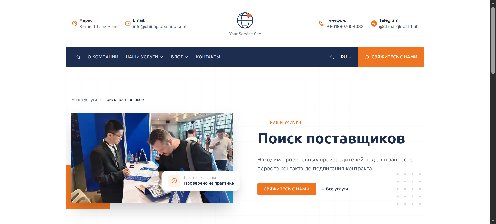
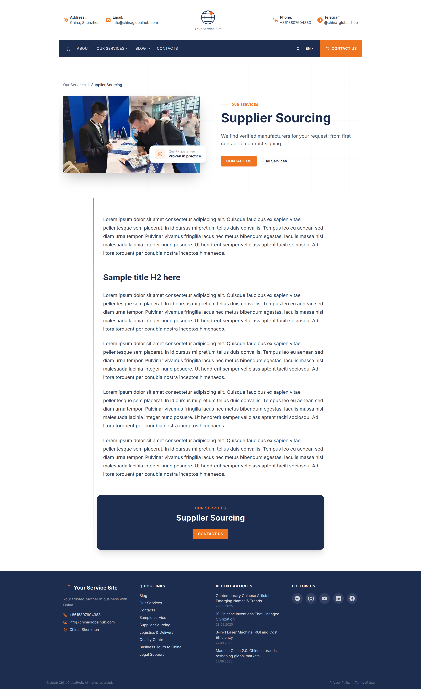
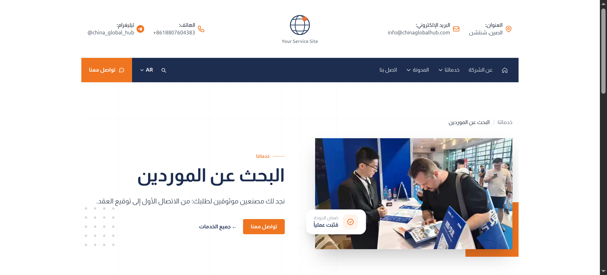
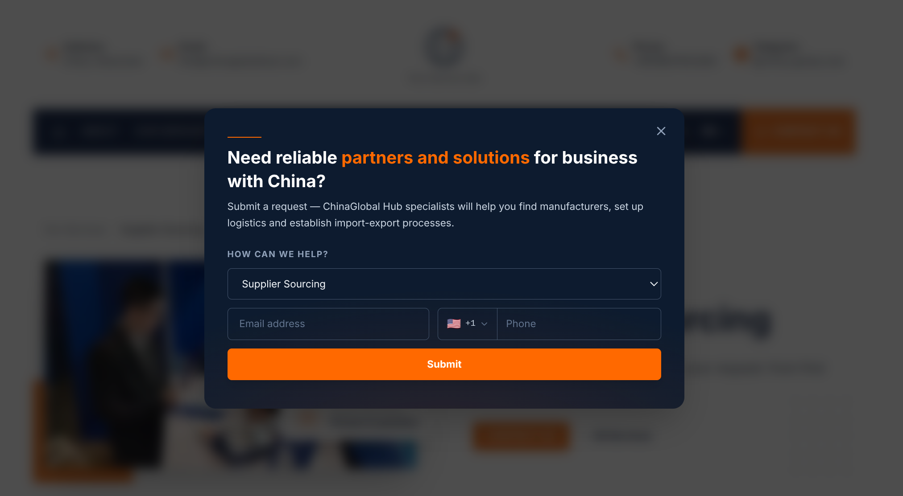
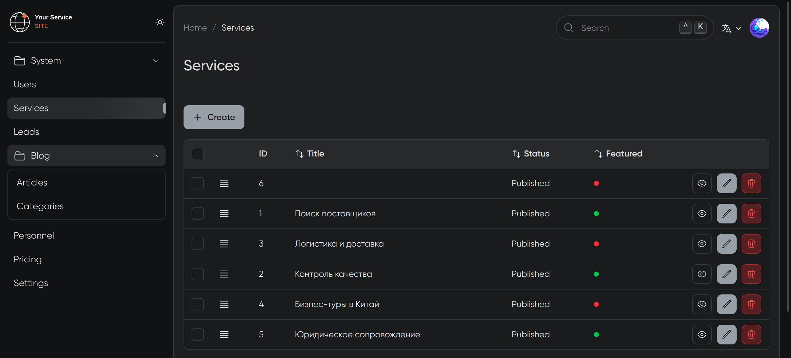
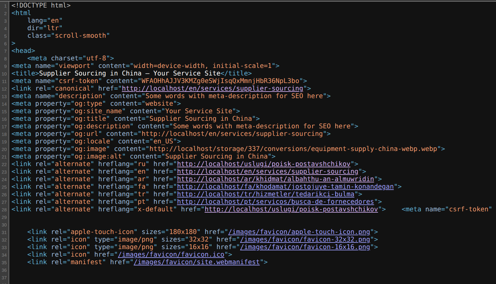
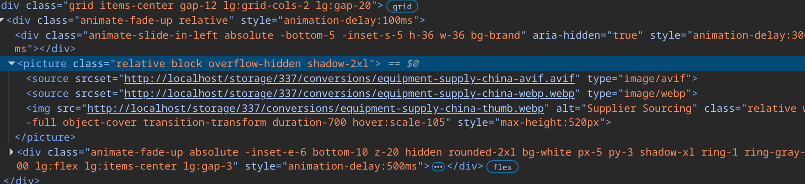
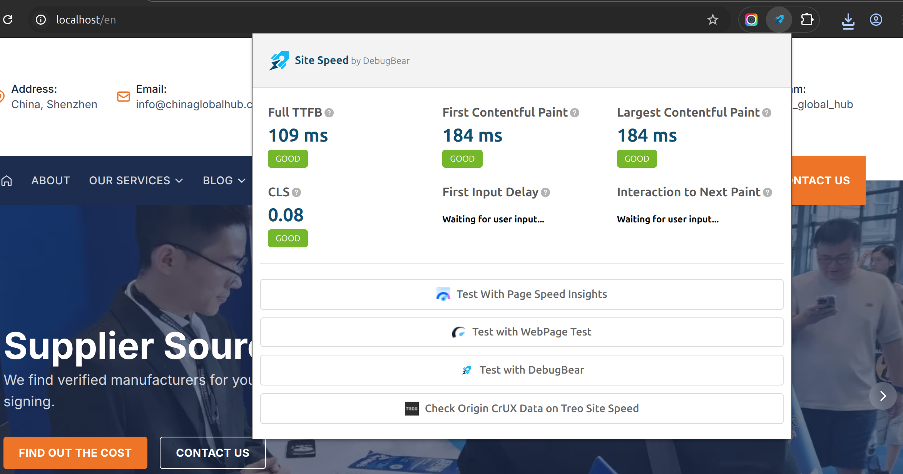

# Multilingual Service Site — Laravel 12

A multilingual B2B web platform built with **Laravel 12** and a modular architecture. Demonstrates production-ready patterns: service/repository layers, Eloquent translations, admin panel, lead capture, and a full PHPUnit test suite.

**Author:** Alexander Bet


---

## Features

- **8 languages** — Russian (default), English, Chinese, Arabic, Farsi, Turkish, Portuguese, Spanish
- **RTL support** — Arabic and Farsi render right-to-left via CSS logical properties
- **Modular architecture** — each domain (Blog, Services, Contact, Core…) is a self-contained Laravel module
- **Service + Repository pattern** — controllers only delegate; all logic and queries are separated
- **Lead capture** — popup form with service selector, phone country code, DB persistence, email notification
- **Admin panel** — Moonshine 4 with Editor.js rich-text, media library, settings management
- **SEO** — per-locale meta tags, Open Graph, canonical URLs, hreflang links
- **Image optimization** — WebP conversion via Spatie Media Library, `<picture>` tags with fallback
- **Performance** — TTFB 109 ms, LCP 184 ms, CLS 0.08 on local Docker

---

## Screenshots

### Multilingual UI — Russian / English / Arabic (RTL)

| Russian | English |
|---------|---------|
|  |  |

**Arabic — full RTL layout**



---

### Lead Capture Popup



Service selector, email + phone with country code picker, Alpine.js — no page reload.

---

### Admin Panel (Moonshine 4)



Full CRUD for services, articles, categories, leads, personnel, pricing, and site settings.

---

### SEO — Meta Tags & Hreflang



Every page outputs structured `<meta>`, Open Graph, and `<link rel="alternate" hreflang>` tags generated from per-locale model data.

---

### Image Optimization — WebP + `<picture>`



Images are converted to WebP by Spatie Media Library on upload. Blade outputs `<picture>` with WebP source and JPEG/PNG fallback.

---

### Performance



Measured with DebugBear on local Docker: **TTFB 109 ms · FCP 184 ms · LCP 184 ms · CLS 0.08**.

---

## Tech Stack

| Layer | Technology |
|-------|-----------|
| Backend | PHP 8.3 · Laravel 12 |
| Frontend | Blade · Alpine.js · Tailwind CSS |
| Admin panel | Moonshine 4 · Editor.js |
| Database | PostgreSQL + pgvector |
| Cache / Queue | Redis 7 |
| Search | Meilisearch (Laravel Scout) |
| Storage | Cloudflare R2 (prod) · MinIO (local) |
| Mail | Resend |
| Infrastructure | Docker Compose · Nginx |

---

## Architecture

The application is split into **Laravel Modules** (`nwidart/laravel-modules`). Each module is self-contained — models, controllers, services, repositories, requests, views, migrations, seeders, and factories all live inside the module.

```
backend/
├── Modules/
│   ├── Blog/        # Articles, categories, Editor.js content
│   ├── Contact/     # Lead capture form, email notifications
│   ├── Core/        # Layout, settings singleton, shared traits
│   ├── Personnel/   # Team members
│   ├── Pricing/     # Pricing plans
│   └── Services/    # Service pages
├── app/
│   └── MoonShine/   # Admin panel resources & layout
└── database/        # Global migrations (users, jobs, cache)
```

### Key patterns

- **Service layer** — all business logic lives in `*Service` classes, controllers only delegate
- **Repository pattern** — all DB queries in `*Repository` classes, services never touch Eloquent directly
- **Form Requests** — every endpoint validates through a dedicated `*Request` class
- **Translatable models** — content in `*_translations` tables via `astrotomic/laravel-translatable`
- **Settings singleton** — global site config in a single DB row with JSON columns, cached in Redis

---

## Tests

**74 tests · 126 assertions** — all passing.

```
Unit/
  Blog/ArticleServiceTest        — service delegates correctly to repository
  Services/ServiceServiceTest    — service delegates correctly to repository
  Models/ServiceIconTest         — HTML entity decoding in icon attribute

Feature/
  Blog/BlogControllerTest        — index, show, category HTTP responses
  Services/ServiceControllerTest — index, show HTTP responses
  Contact/ContactFormTest        — form validation and redirect
  Contact/LeadControllerTest     — JSON API validation and DB persistence

Feature/Repository/
  ArticleRepositoryTest          — filtering, pagination, locale, ordering
  ServiceRepositoryTest          — filtering, featured scope, sort order
  LeadServiceIntegrationTest     — DB persistence, email notification
```

```bash
docker exec chinaglobalhub_laravel php artisan test
```

---

## Local Development

**Prerequisites:** Docker, Docker Compose

```bash
git clone https://github.com/alexander-bet/laravel-multilingual-portal-example.git
cd laravel-multilingual-portal-example

cp backend/.env.example backend/.env
# fill in DB, mail, storage credentials

docker compose up -d

docker exec chinaglobalhub_laravel composer install
docker exec chinaglobalhub_laravel php artisan key:generate
docker exec chinaglobalhub_laravel php artisan migrate --seed

docker exec chinaglobalhub_laravel npm install
docker exec chinaglobalhub_laravel npm run build
```

App: **http://localhost** · Admin: **http://localhost/admin**

### Services

| Service | Port |
|---------|------|
| Nginx | 80 |
| Laravel (PHP 8.3) | 8000 |
| PostgreSQL | 5432 |
| Redis | 6379 |
| Meilisearch | 7700 |
| MinIO (S3) | 9000 |
| MinIO Console | 9001 |
| Mailpit (email preview) | 8025 |

---

## Roadmap

**Phase 1 (current)** — Monolith: blog, services, contact forms, admin panel.

**Phase 2 (planned)** — Catalog module: manufacturers, translators, agencies. Next.js frontend + Laravel API, Sanctum auth, pgvector semantic search, AI translation via Claude API.
